# 🎉 Volunteer Platform

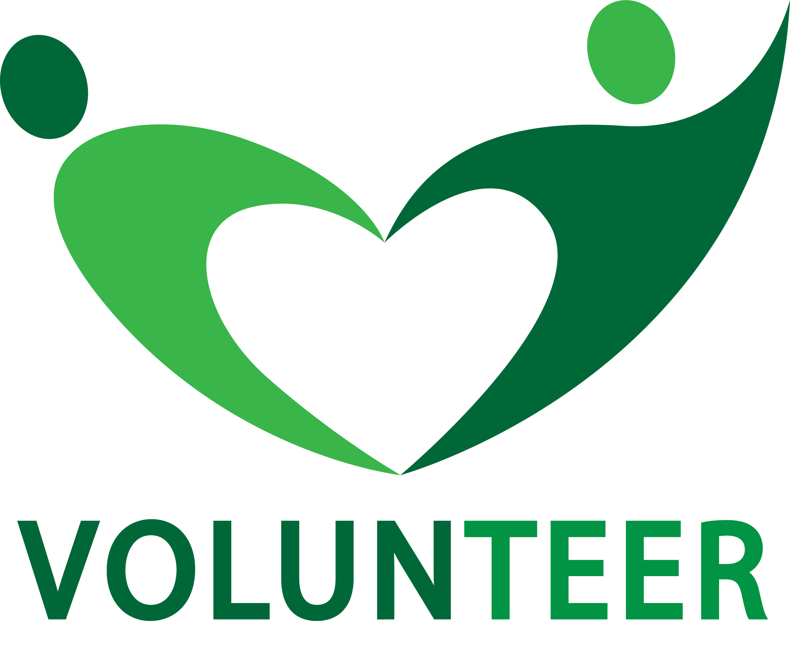

## 🌟 Project Overview

The **Volunteer Platform** is designed to facilitate connections between volunteers and associations, simplifying the application process for various events organized by associations. Developed using UML and Java EE, this platform aims to streamline the management of volunteer opportunities while ensuring a smooth user experience.

## 🚀 Features

- 🗓️ **Event Publication**: Associations can easily publish events.
- 🙋‍♂️ **Volunteer Applications**: Volunteers can apply for events with a user-friendly interface.
- 🛠️ **Centralized Management**: Both volunteers and associations can manage their interactions seamlessly.
- 🎨 **Graphical Interfaces**: Engaging and intuitive graphical interfaces for volunteers and associations.

## 🛠️ Technologies Used

- **Java EE**: For backend development.
- **UML**: For system modeling and architecture design.
- **HTML/CSS**: For frontend design.
- **MySQL**: For database management.

## 🏗️ System Architecture

The architecture is modeled using UML diagrams, highlighting the various classes, interactions, and key processes involved in the application.

### 🖥️ Graphical Interfaces

#### Home Page
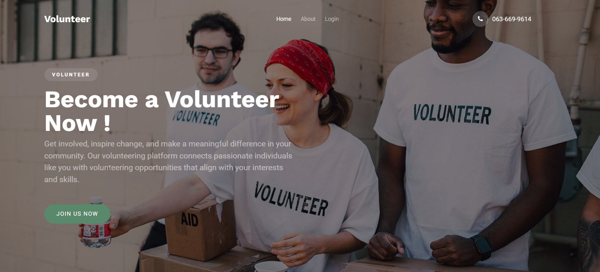

#### About Us
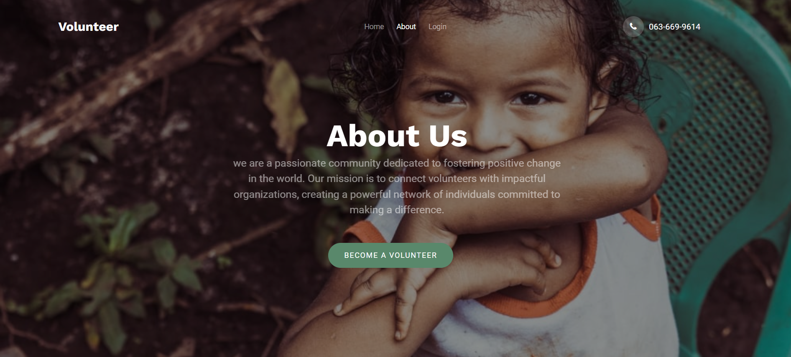

### 🔑 Login and Registration Interfaces

#### Login Form & Registration Form
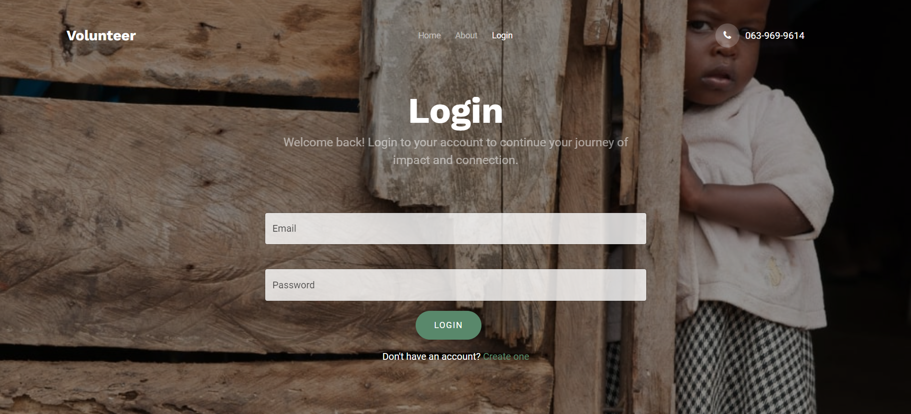 
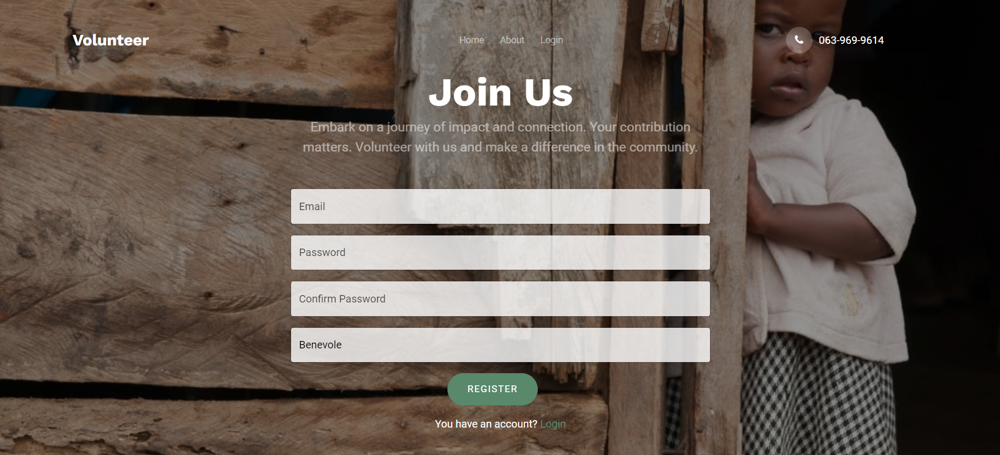

### 🛠️ Volunteer Space Interfaces

#### Volunteer Registration Form & Home Page
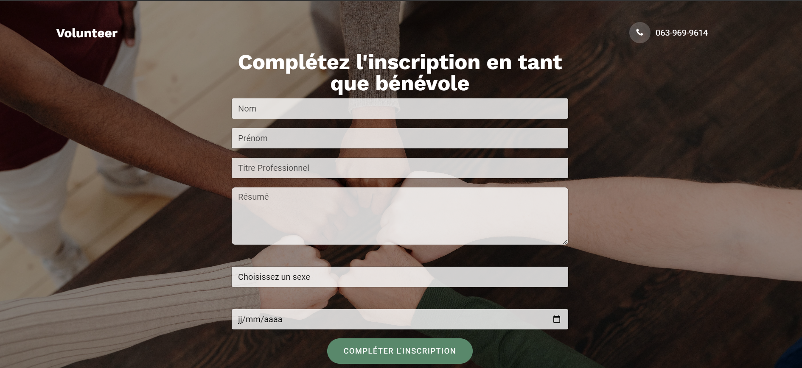 

#### Volunteer Profile & Update Profile
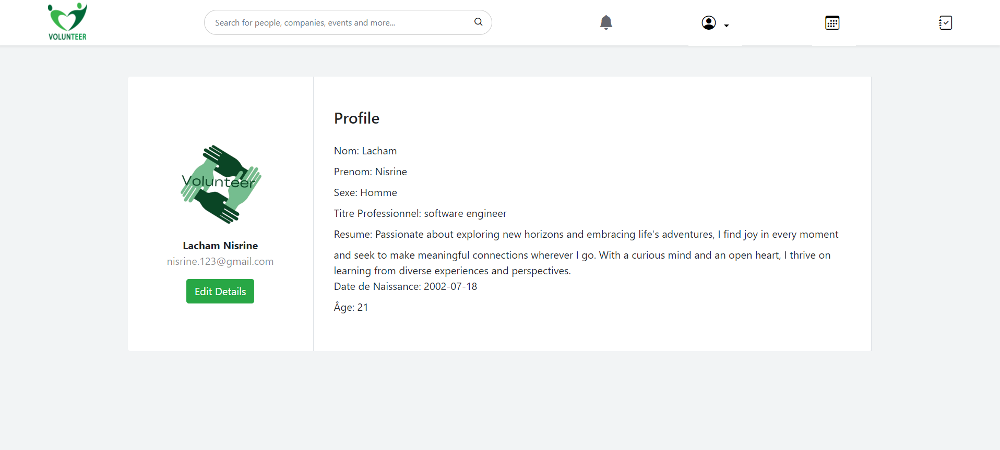 
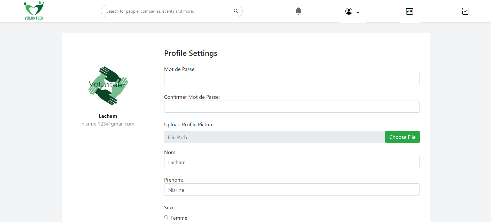

#### Events Interface & Event Details
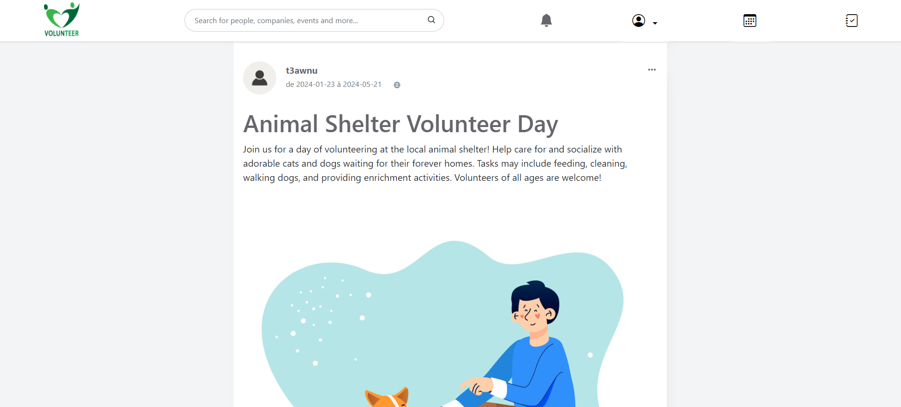 
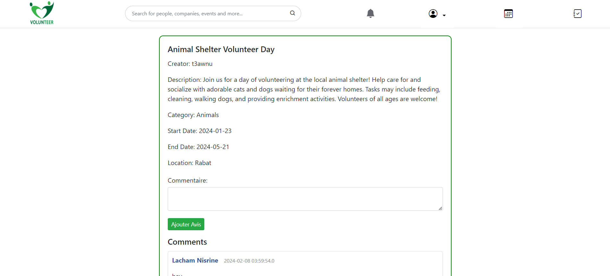

#### Apply for an Event & Volunteer Applications
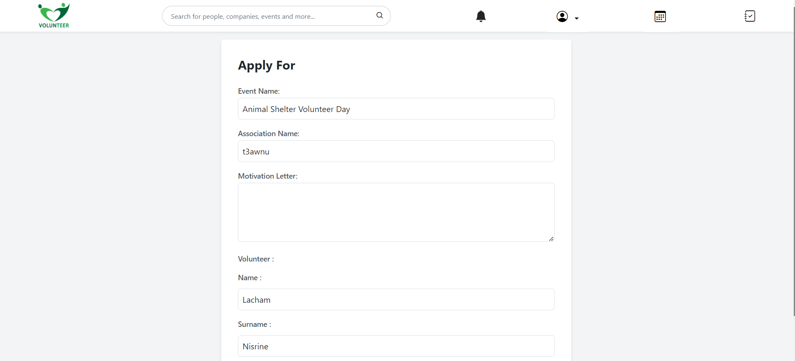 
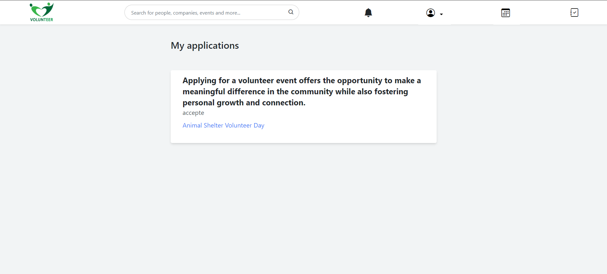

### 🏢 Admin Association Interfaces

#### Organisation Registration Form & Admin Home Page
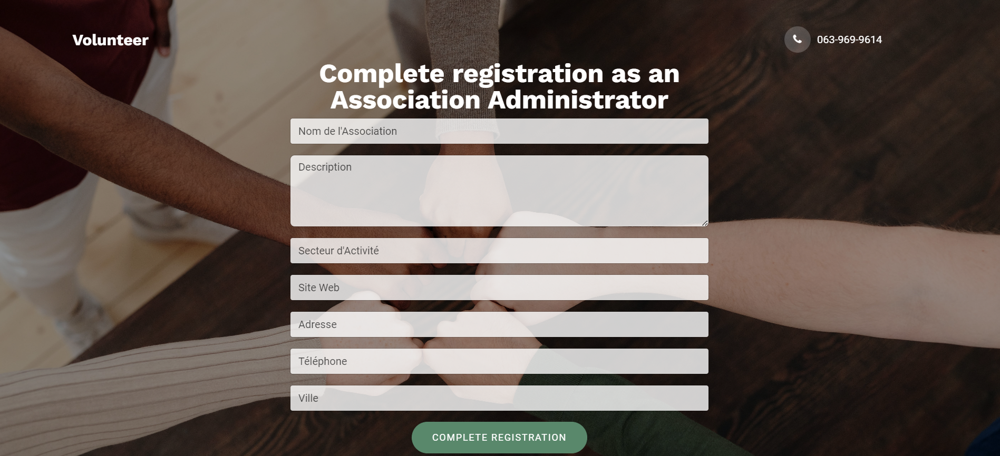 
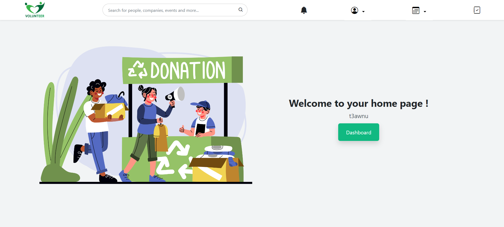

#### Admin Dashboard & Admin Profile
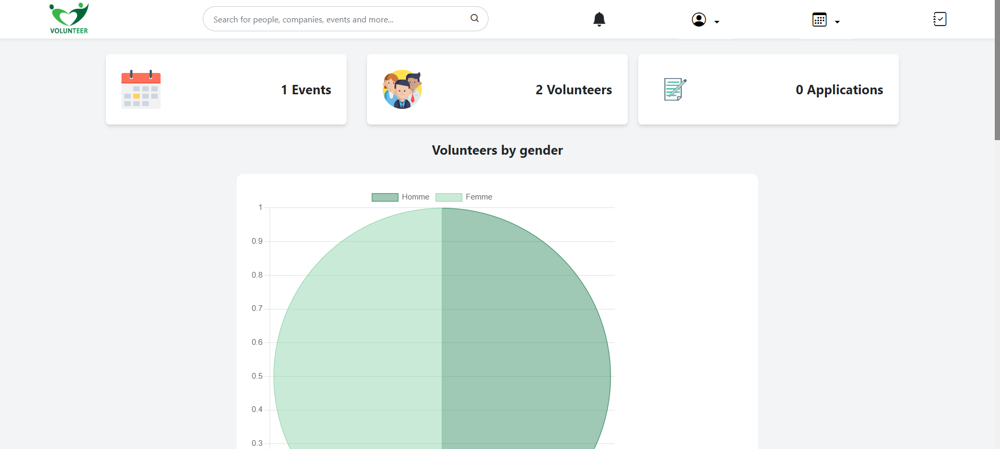 
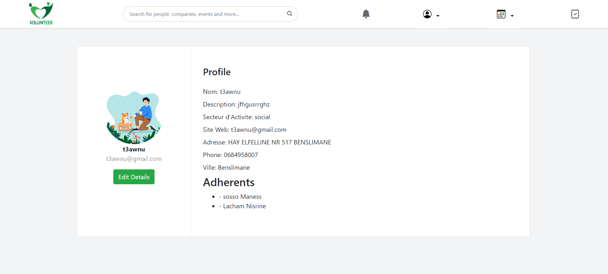

#### Application Processing Form
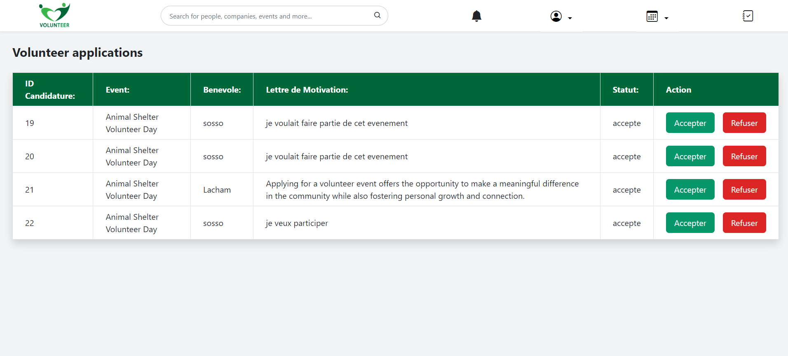

## 🚀 Getting Started

To get started with the project, clone the repository and set up your environment:

```bash
git clone https://github.com/yourusername/volunteer-platform.git
cd volunteer-platform


```bash
git clone https://github.com/saraamas/PlateformeBenevolat.git
cd volunteer-platform
